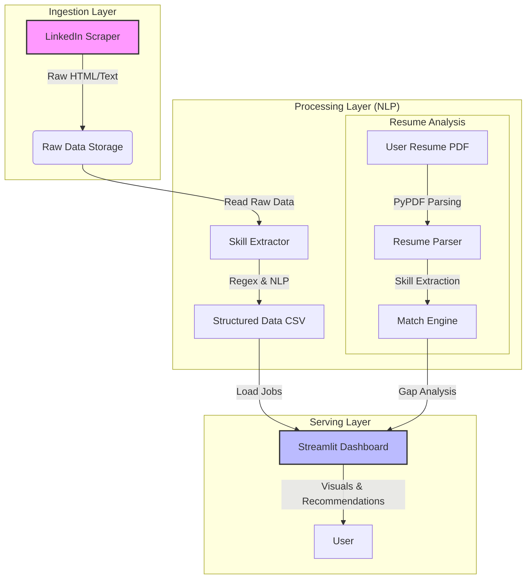

# 💼 Job Market Trends Analyzer & Resume Matcher
> **End-to-End Data Pipeline & AI-Powered Career Assistant**


## 📌 Project Overview
This project is an **End-to-End Data Engineering & Science Portfolio** designed to bridge the gap between job seekers and market demands. It automates the collection of job postings, extracts key skill requirements using NLP, and provides a **Personalized Resume Matching System**.

**Key Features:**
*   **🤖 Automated Data Pipeline**: Scrapes real-time job postings (LinkedIn) using Selenium.
*   **🧠 NLP Skill Extraction**: Parses unstructured Job Descriptions (JD) to extract tech stacks (e.g., "Python", "AWS", "Large Language Models").
*   **🎯 Intelligent Resume Matcher**: Parses user resumes (PDF), compares them against job requirements, and performs a Gap Analysis (Missing vs. Matched Skills).
*   **📊 Interactive Dashboard**: Visualizes salary trends, top in-demand skills, and personalized job recommendations.

---

## 🏗️ Architecture

The system follows a modern ETL (Extract, Transform, Load) pattern with a serving layer.



## 🛠️ Tech Stack
| Category | Technologies |
|----------|--------------|
| **Language** | Python 3.9+ |
| **Data Collection** | Selenium Webdriver, BeautifulSoup |
| **Processing & NLP** | Pandas, NLTK, Regex, PyPDF (Resume Parsing) |
| **Visualization** | Streamlit, Plotly Express |
| **Infrastructure** | Docker, Docker Compose |

---

## 🚀 Getting Started

### 1️⃣ Local Installation (Without Docker)

1.  **Clone the repository:**
    ```bash
    git clone https://github.com/your-username/job-market-analyzer.git
    cd job-market-analyzer
    ```

2.  **Install dependencies:**
    ```bash
    pip install -r requirements.txt
    ```

3.  **Run the Pipeline (Optional - if you want fresh data):**
    ```bash
    # 1. Scrape Data
    python src/ingestion/scraper.py
    
    # 2. Process & Extract Skills
    python src/processing/extractor.py
    ```

4.  **Launch the Dashboard:**
    ```bash
    streamlit run src/dashboard/app.py
    ```

### 2️⃣ Running with Docker (Recommended)

Ensure you have Docker installed.

1.  **Build and Run:**
    ```bash
    docker-compose up --build
    ```

2.  **Access the App:**
    Open your browser at `http://localhost:8501`

---

## 📂 Project Structure
```bash
job-market-analyzer/
├── data/               # Local storage for data (Git-ignored)
│   ├── raw/            # Raw HTML/JSON job postings
│   └── processed/      # Cleaned CSVs with extracted skills
├── notebooks/          # Jupyter notebooks for EDA & Prototyping
├── src/                # Source code
│   ├── ingestion/      # Scrapers & API clients
│   ├── processing/     # Cleaning, NLP, & Resume Matching Logic
│   └── dashboard/      # Streamlit Application
├── tests/              # Unit tests
├── Dockerfile          # Docker image configuration
├── docker-compose.yml  # Container orchestration
├── requirements.txt    # Python dependencies
└── README.md           # Documentation
```

## 👥 Author
*   **Shawn Nam**
*   **Contact**: 'https://www.linkedin.com/in/shawn-nam-b79614204/' | [tjr001136@gmail.com]
